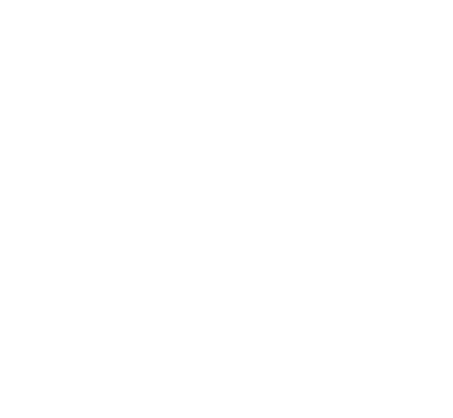
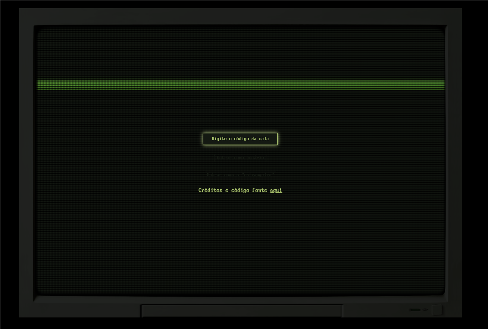
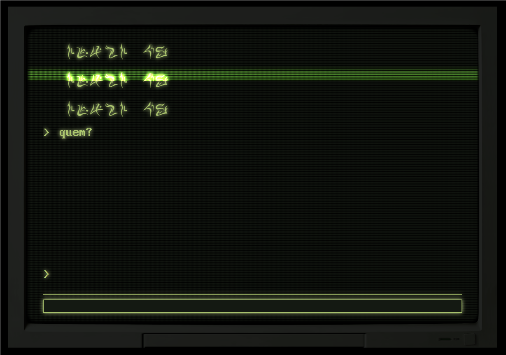
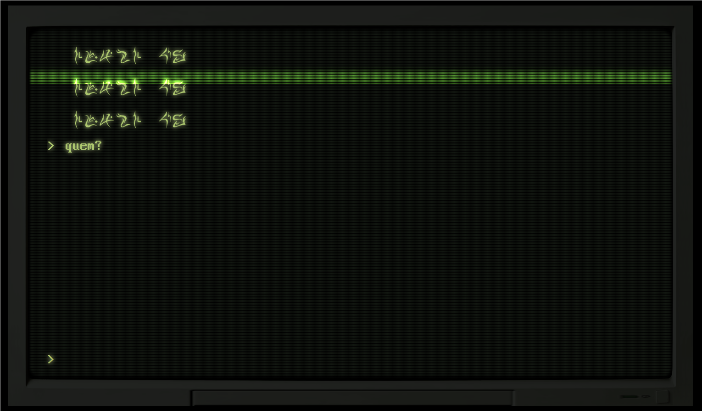

<h1 align="center">Estrangeiro Chat</h1>

A copy of the terminal program used in Cellbit's Ordem Paranormal: Sinais do Outro Lado tabletop RPG.

Made with Next.js and SCSS, hosted in Heroku.

---

| What             | Who                                                                                    |
| ---------------- | -------------------------------------------------------------------------------------- |
| Estrangeiro Font | [Ordem Paranormal Wiki](https://ordemparanormal.fandom.com/wiki/Ordem_Paranormal_Wiki) |
| Programming      | Peterson "Prize" Adami Candido                                                         |